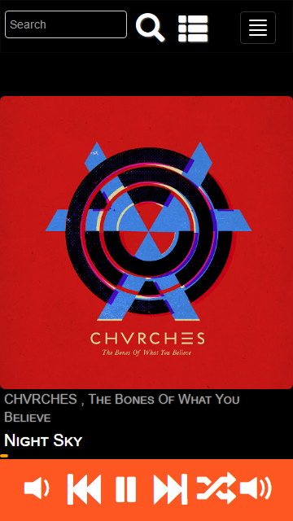
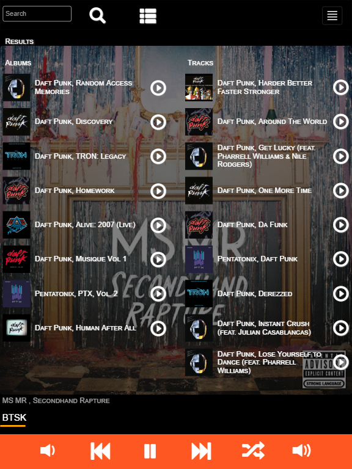
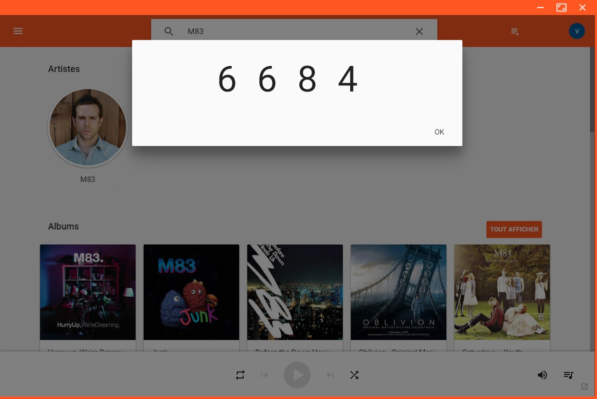

# gmusic-desktop-remote

  
  
  
  
  <h1>Description</H1>
  

Google Play Music Desktop Player is needed to receive commands from this Remote Control App.  
The Remote Control apps allow you to remotely control Google Play Music Desktop Player from your android tablet and smartphone. You can download the latest version on the playstore 

 This application is based on the APIs from this git: 
https://github.com/MarshallOfSound/Google-Play-Music-Desktop-Player-UNOFFICIAL- 

Download the "server side" from: 
https://www.googleplaymusicdesktopplayer.com/ 
 
Download the app on the playstore: 
https://play.google.com/store/apps/details?id=tk.cvando.gmusic_desktop_remote

 
 
<h1>Usage</h1>
<ul>
  <li>Download Google Play Music Desktop Player and connect to your google account </li>
  <li>Go to Desktop settings and click on enable Playback API  
  
  </li>
   
  <li>On the application click on settings and type the ip of the Google Play Music Desktop Player and click on the red check icon or press enter  
 
  
  </li>
     
  <li>A code appears on  Google Play Music Desktop Player 
  
  </li>
   
  <li>Type the code in the popup 
  
  </li>
   
  <li>The application is now connected to Google Play Music Desktop Player. 
  The red check icon is now green
  </li>
  </ul>
   
   
  <h1>Features</h1>
  <ul>
  <li>play, pause, rewind, forward</li>
  <li>Swipe right to see your playlists</li>
  <li>Swipe left to see the queue</li>
  <li>Type an artist or song in the search bar and press enter </li>
  <li>Play from the result screen</li>
  <li>Select and play song from the queue</li>
  <li>Select and play a playlist from the playlists screen</li>
  <li>When the playlist is playing, play a song from the playlists screen</li>
  <li>Show your library from the icon on top (play from it soon)</li>
  </ul>
